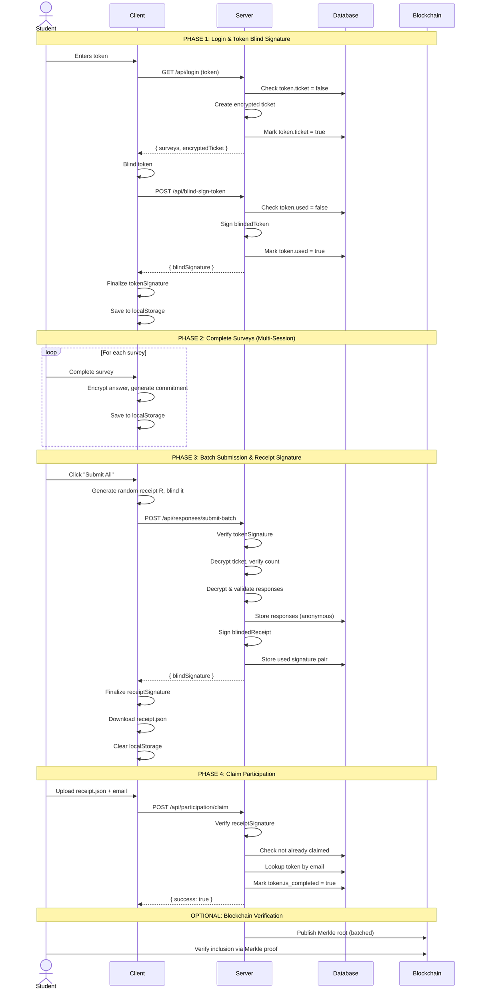
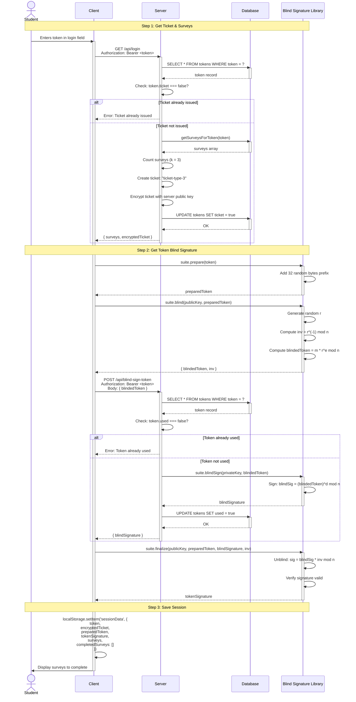
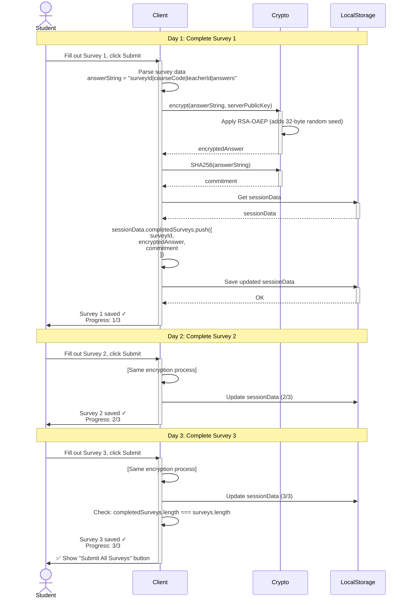
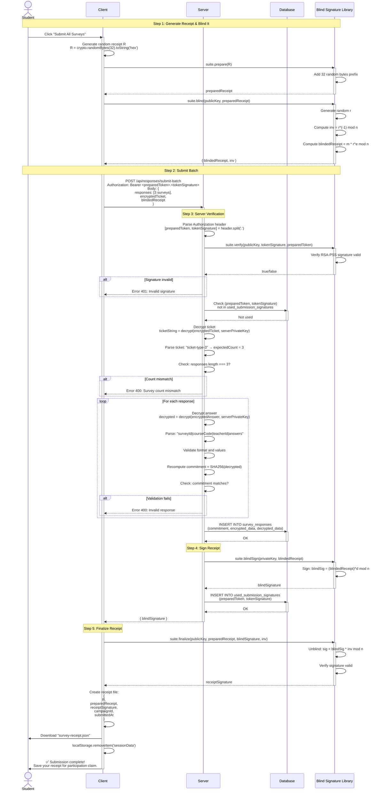
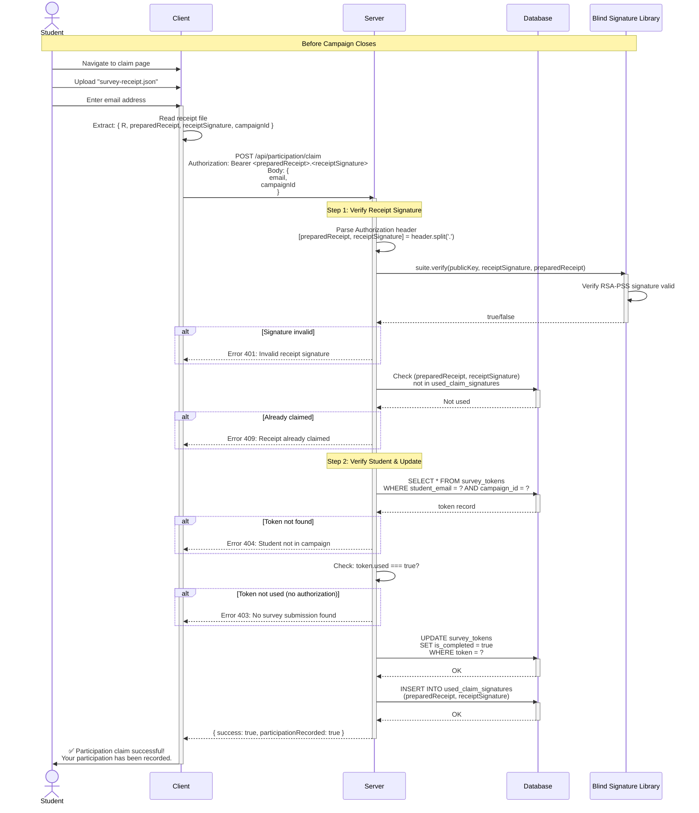
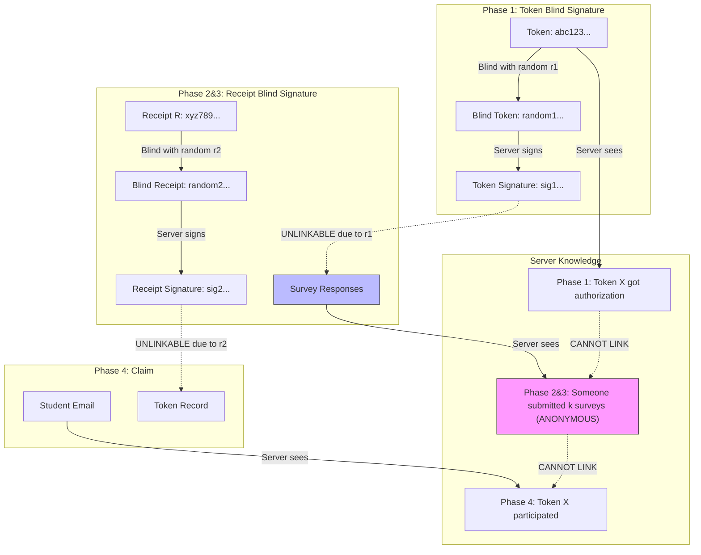
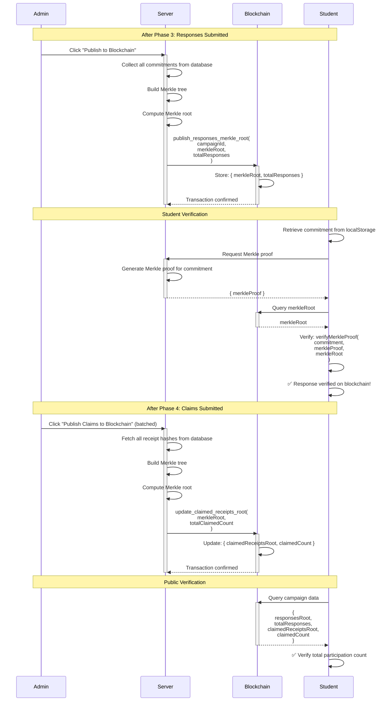

# Double Blind Signature Workflow - Sequence Diagrams

This document contains sequence diagrams for the anonymous survey system using double blind signatures.

**Note**: These diagrams use Mermaid syntax. To view them:
- View on GitHub (renders automatically)
- Use VS Code with Mermaid extension
- Use online viewer: https://mermaid.live/

---

## Overview Diagram - All 4 Phases

---

## Phase 1: Login & Token Blind Signature (Detailed)

---

## Phase 2: Complete Surveys Incrementally (Detailed)

---

## Phase 3: Batch Submission & Receipt Signature (Detailed)

---

## Phase 4: Claim Participation (Detailed)

---

## Privacy Analysis Diagram

---

## Blockchain Integration Diagram (Optional)

---

## Key Points

### Privacy Guarantees

1. **Phase 1 → Phase 2&3**: Unlinkable due to random blinding factor r1
2. **Phase 2&3 → Phase 4**: Unlinkable due to different blind signature key pair + random r2
3. **Server cannot link**:
   - Token to survey responses (blind signature unlinkability)
   - Receipt to token (different key pair + blind signature)

### Security Features

1. **Encrypted Ticket**: Enforces correct survey count, standardized per count
2. **Double Blind Signature**: Two independent blind signature layers
3. **Commitment Verification**: Ensures response integrity
4. **Used Signature Tracking**: Prevents replay attacks
5. **Blockchain Merkle Trees**: Provides public verifiability

### Multi-Session Support

- Student can complete surveys over multiple days
- Progress saved in localStorage
- Batch submission only when all k surveys complete
- Receipt downloaded at end (not stored in localStorage)

---

**Document Created**: 2025-12-01
**Compatible with**: DOUBLE_BLIND_SIGNATURE_WORKFLOW.md
**Mermaid Version**: Compatible with Mermaid 9.0+
